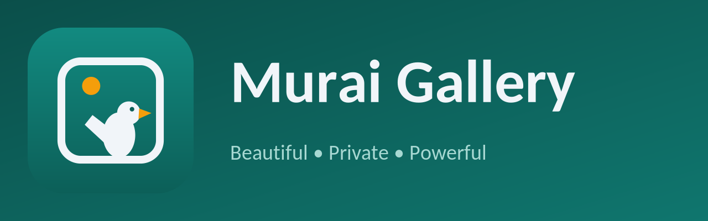

<p align="center">
  
</p>

<h1 align="center">Murai Gallery</h1>

<p align="center">
  <strong>A beautiful, private and powerful media gallery — with a full toolbox built in.</strong>
</p>

<p align="center">
  <a href="https://github.com/tukiza7-debug/murai-gallery/releases/latest"></a>
  <a href="https://github.com/tukiza7-debug/murai-gallery/actions/workflows/release.yml"></a>
  <a href="https://github.com/tukiza7-debug/murai-gallery/actions/workflows/quality-check.yml"></a>
  
  <a href="LICENSE"></a>
</p>

---

Murai Gallery is a modern Android gallery app for photos and videos: fast browsing, deep metadata,
strong privacy, and a set of 16 extra tools that go far beyond a plain gallery. It is a fork of the
excellent open-source gallery **Aves**, rebranded and extended.

## Install

1. Open the [latest release](https://github.com/tukiza7-debug/murai-gallery/releases/latest).
2. Download an APK:
   - `MuraiGallery-x.y.z-universal.apk` — works on **every** device (larger download), or
   - pick your ABI: `arm64-v8a` (most modern phones), `armeabi-v7a` (older phones), `x86_64` (emulators/ChromeOS).
3. Install the APK (allow "install from this source" when prompted).

Every push to `main` is built, signed and published automatically as a new release — always check
the latest one for the newest features.

## Features

### Original Aves features

- Collections, albums (incl. dynamic/automatic albums), tags, countries, states and places
- Powerful search with query language and saved filters
- Map view with geo-tagged media clustering
- Statistics page (collection breakdown charts)
- Rich metadata viewer and editor (EXIF, XMP, IPTC)
- Motion photo, panorama and 360° video support
- Multi-page formats: TIFF, SVG, and more
- Vault for hiding albums, and a bin (trash) with restore
- Slideshow, screen saver, cast, DLNA
- Home screen widgets and app shortcuts
- Light / dark / AMOLED black themes, dynamic color (Material You)
- 50+ languages, instant in-app language switch

### New in Murai Gallery (the 16)

| # | Tool | What it does |
|---|------|--------------|
| 1 | **Duplicate Finder** | Exact duplicates by hash + similar photos by perceptual hash, side-by-side preview, bulk delete |
| 2 | **Full Image Editor** | Crop, rotate/flip, brightness/contrast/saturation, filter presets, text overlays, freehand drawing, emoji stickers |
| 3 | **Video Trimmer** | Pick start/end on a frame-strip timeline, saves a losslessly trimmed MP4 |
| 4 | **Compressor & Resizer** | Batch-reduce photo size/resolution with a quality slider and before/after sizes |
| 5 | **OCR Text Extractor** | Read text from photos fully offline, copy and reuse it |
| 6 | **Collage Maker** | Combine 2–9 photos with grid templates, borders and background color |
| 7 | **GIF Maker** | Create animated GIFs from a video clip or a sequence of images |
| 8 | **Batch Rename** | Pattern-based renaming (`{date}`, `{time}`, `{counter}`, `{name}`, `{ext}`) with live preview |
| 9 | **Storage Cleaner** | Usage by folder and type, large files, screenshots, old downloads — with one-tap cleanup |
| 10 | **QR / Barcode Scanner** | Detect and decode codes inside your photos, open links safely after confirmation |
| 11 | **Auto Wallpaper Changer** | Rotate your wallpaper from chosen albums hourly/daily/weekly (WorkManager) |
| 12 | **Share to Telegram** | Send selected media via your own bot (token + chat ID), with progress and automatic retries |
| 13 | **Advanced Sort** | 10 sort types (date taken, date added, name, size, type, resolution, duration, rating & favorites, location, random) with direction toggle, live preview, group-by combination, per-screen memory, saved presets, and "set as default" |
| 14 | **Private Vault Upgrade** | Decoy PIN that opens a fake empty gallery, vault hidden from recents, biometric unlock support |
| 15 | **Backup & Restore** | Export settings, favourites, sort presets and tool configuration to a zip; import anywhere |
| 16 | **Settings Upgrades** | In-app update checks via GitHub Releases (with clear offline messaging), error library with 30-day retention and export, AMOLED/dynamic theme options, instant language switching |

All heavy work (hashing, compression, GIF/video encoding, sorting, uploads) runs in background
isolates or Kotlin coroutines with progress notifications, so the UI never freezes.

## Build from source

Requirements: Android Studio (or the Android SDK), JDK 21. The Flutter SDK is bundled via the
`.flutter` submodule — no separate Flutter install needed.

```bash
git clone --recurse-submodules https://github.com/tukiza7-debug/murai-gallery.git
cd murai-gallery

# set up the bundled Flutter SDK and dependencies (play flavor)
./flutterw pub get
./flutterw gen-l10n

# debug build
./flutterw build apk --debug --flavor play -t lib/main_play.dart

# release build (needs signing configuration, see below)
./flutterw build apk --release --flavor play -t lib/main_play.dart --split-per-abi
```

### Signing

Debug builds need no configuration. Release builds read a keystore from (in order):

1. `android/key.properties` (local file — see `android/key_template.properties`), or
2. environment variables (used by CI): `MURAI_STORE_FILE`, `MURAI_STORE_PASSWORD`, `MURAI_KEY_ALIAS`, `MURAI_KEY_PASSWORD`.

Without either, the APK builds unsigned — no crash, no secrets required.

### Required GitHub Secrets (for the release workflow)

| Secret | Description |
|--------|-------------|
| `MURAI_KEYSTORE_BASE64` | Base64 of your release keystore (`base64 -w0 murai-release.jks`) |
| `MURAI_STORE_PASSWORD` | Keystore password |
| `MURAI_KEY_ALIAS` | Key alias inside the keystore |
| `MURAI_KEY_PASSWORD` | Key password |

The repository ships with a CI-only demo keystore in secrets so that builds work out of the box.
**For production, generate your own keystore and replace all four secrets.**

### Versioning

Each push to `main` produces a release automatically:

- versionName = `1.0.<run number>`
- versionCode = `<run number>`
- tag = `v1.0.<run number>`

## Permissions

Murai Gallery only asks for what it needs, always with a short explanation first:

| Permission | Why |
|------------|-----|
| `READ_MEDIA_IMAGES` / `READ_MEDIA_VIDEO` (+ `READ_MEDIA_VISUAL_USER_SELECTED`) | Android 13+ scoped media access to show your gallery |
| `READ_EXTERNAL_STORAGE` (≤ Android 12) | Same, on older Android versions |
| `ACCESS_MEDIA_LOCATION` | Read embedded GPS for the map and metadata (you can turn it off) |
| `POST_NOTIFICATIONS` | Progress of long tools (duplicates scan, compression, uploads) and playback controls |
| `SET_WALLPAPER` | Applying / auto-rotating your wallpaper |
| `INTERNET` | Optional features only: map tiles, Telegram sharing, update checks |
| `WAKE_LOCK`, `RECEIVE_BOOT_COMPLETED` | Reliable background analysis and wallpaper scheduling |
| Biometric (via system prompt) | Unlocking vaults when you choose the "system" lock type |

Murai Gallery contains **no ads and no analytics**. Nothing leaves your device unless you use the
map, Telegram sharing, or the manual update check.

## Credits

Murai Gallery is based on [**Aves**](https://github.com/deckerst/aves) by
[deckerst](https://github.com/deckerst) and its contributors — thank you for the incredible
foundation. The murai (Oriental magpie-robin) logo was designed for this project.

## License

Like Aves, Murai Gallery is licensed under the [BSD-3-Clause License](LICENSE).
