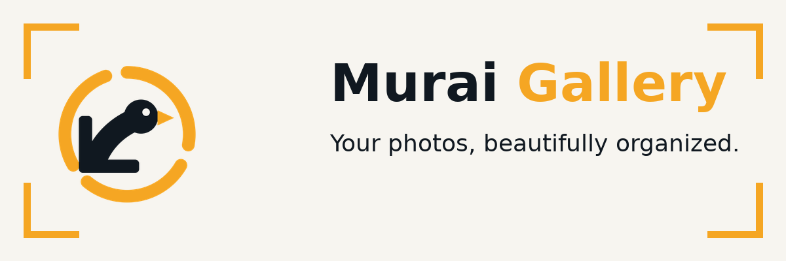

<div align="center">



# Murai Gallery

**Your photos, beautifully organized. Fast. Private. Yours.**


</div>

---

## What is Murai Gallery?

Murai Gallery is an Android gallery built around one idea: your photo library should be *fast to browse, smart to organize, and yours to control*. The app keeps everything on your device — no accounts, no analytics, no cloud — while packing a complete smart-tools suite (duplicate finder, image editor, OCR, collage maker, auto wallpaper and more) on top of a fluid Material 3 timeline.

## Why v2.0.0 is a major update

**v2.0.0 is not an update to the old engine — it is a brand-new app.** Every line of Kotlin, every screen, every string and every asset was written from scratch:

| | v1.x | **v2.0.0** |
|---|---|---|
| Engine | Cross-platform framework shell | **Native Kotlin + Jetpack Compose** |
| Design | Framework-flavored UI | **Original Ink & Amber design system** |
| Media pipeline | External scanner | **Original Room-backed library engine with paged background scanning** |
| Tools | Partial set | **All 16 smart tools, built-in** |
| Branding | First Murai mark | **New aperture-ring identity, new icon, new splash** |

The result is smaller, faster, and fully under our own architecture.

## Features

### Core Gallery
- **Timeline & collections** with paged loading — the grid paints immediately even on 50,000+ item libraries
- **Albums** with cover art and counts, **Favorites**, and a safe **Bin** with restore
- **Search** by name, folder, place, date, type and size
- **Full-screen viewer** with pinch-zoom, double-tap, swipe and transitions
- **Video player** (Media3/ExoPlayer), **GIF & animated WebP** playback
- **Motion photo** playback and **panorama / 360°** panning viewer
- **Metadata viewer & editor** — edit EXIF date and GPS location
- **Photo map** of geotagged pictures (OpenStreetMap)
- **Library stats** — totals, sizes, months, folders, file types
- **Slideshow**, share / set-as / delete / move / copy, **multi-select**
- **Home-screen widget** showing your latest photo

### Smart Tools — the 16 additions
1. **Duplicate Finder** — exact SHA-256 matches *and* look-alike shots via perceptual hashing, side-by-side preview, batch clean-up
2. **Image Editor** — crop, brightness / contrast / saturation, 8 filters, text, freehand drawing, emoji stickers, undo
3. **Video Trimmer** — pick start & end, save as a new clip
4. **Compressor & Resizer** — batch quality slider, size presets, before/after sizes and total savings
5. **Text Extraction (OCR)** — fully offline, copy or share the result
6. **Collage Maker** — 2–9 photos, multiple grid templates, spacing, backgrounds
7. **GIF Maker** — turn a video segment into an animated GIF with the built-in original encoder
8. **Batch Rename** — `{date}`, `{counter}`, `{name}`, `{ext}` patterns with live preview
9. **Storage Cleaner** — folder usage, biggest files, screenshot sweeps
10. **QR & Barcode Scanner** — scans codes *inside your photos*, with HTTPS safety checks before opening links
11. **Auto Wallpaper Changer** — WorkManager rotation from your chosen albums, hourly to daily
12. **Share to Telegram** — direct bot-API upload with progress and retries, file (no recompression) mode
13. **Advanced Sort** — the 10 sort types below, with presets, grouping and per-screen memory
14. **Vault Upgrade** — PIN + biometric unlock, hardware-backed encryption, and a **decoy PIN** that opens an innocent decoy space
15. **Backup & Restore** — settings, tags, favorites and sort presets exported as one zip
16. **Settings Upgrade** — instant whole-app language switcher, 30-day on-device error log with zip export, light / dark / AMOLED / dynamic-color themes, in-app update check via GitHub Releases with a clear offline message

### Privacy & Security
- No analytics, no tracking, no servers — network is used only for map tiles, update checks and features you trigger
- Vault media is AES/GCM-encrypted with a key sealed in AndroidKeyStore
- PINs are salted + PBKDF2-hashed; a decoy PIN protects you under pressure
- Every permission request is explained first; every destructive action warns first

### Customization
- Light, dark, **AMOLED-pure-black** and **Material You dynamic** color
- 10 app languages, switched instantly for the whole app
- Grid density (2–6 columns) per taste, remembered per screen

### The 10 advanced sort types

| # | Sort | What it does |
|---|------|--------------|
| 1 | **Date taken** | EXIF capture date, falling back to modification time |
| 2 | **Date added** | When the item entered your library |
| 3 | **Name (natural)** | IMG_2 comes before IMG_10 — human order |
| 4 | **File size** | Largest or smallest first |
| 5 | **File type** | Groups by format/extension |
| 6 | **Resolution** | By megapixels |
| 7 | **Video duration** | Longest or shortest clips first |
| 8 | **Rating & favorites first** | Your starred and hearted media rises to the top |
| 9 | **Location** | Country → place ordering |
| 10 | **Random** | Shuffle with an in-session seed and a *Reshuffle* button |

Every sort has an **ascending/descending toggle**, combines with **Group By** (day / month / year / album / type / location), can be saved as a **named preset** (e.g. "Biggest videos"), and **each screen remembers its own order** — set any screen's choice as its default just by leaving it. Sorting runs off the main thread over a minimal key projection, so 50,000+ items stay smooth.

## Install

1. Open the [**Releases**](https://github.com/tukiza7-debug/murai-gallery/releases) page.
2. Download the APK for your device:
   - `arm64-v8a` — virtually all modern phones (recommended)
   - `armeabi-v7a` — older 32-bit devices
   - `x86_64` — emulators and ChromeOS
   - `universal` — works everywhere, larger file
3. **Updating from v1.0.6:** v2.0.0 is a full rewrite shipped with a **new signing key**. Please **uninstall v1.0.6 first**, then install v2.0.0. (Your photos live in the system gallery and are unaffected.)
4. Verify what you downloaded: every release ships `SHA256SUMS.txt` with checksums for every APK.

**Supported versions:** Android 8.0 (API 26) and newer, phones and tablets, portrait and landscape.

### Permissions and why

| Permission | Why |
|---|---|
| `READ_MEDIA_IMAGES` / `READ_MEDIA_VIDEO` (Android 13+) | Show your gallery; older devices use the classic storage permission |
| `ACCESS_MEDIA_LOCATION` | Pin geotagged photos on the map |
| `POST_NOTIFICATIONS` | Progress for long tools (GIF export, wallpaper rotation) |
| `SET_WALLPAPER` | Applying wallpapers, manual and automatic |
| `USE_BIOMETRIC` | Vault fingerprint unlock |
| `INTERNET` | Map tiles, GitHub update checks, Telegram sharing — nothing else |

## Build from source

```bash
git clone https://github.com/tukiza7-debug/murai-gallery.git
cd murai-gallery
./gradlew assembleDebug          # debug build, no signing needed
./gradlew assembleRelease        # needs the keystore env vars (see CI)
```

Requirements: JDK 17, Android SDK 35. The repo pins Gradle 8.10.2 via the wrapper.

### Required GitHub Secrets (CI release signing)

| Secret | Content |
|---|---|
| `KEYSTORE_BASE64` | Base64 of the release `.jks` keystore |
| `KEYSTORE_PASSWORD` | Keystore password |
| `KEY_ALIAS` | Signing key alias |
| `KEY_PASSWORD` | Key password |

Every push to `main` builds a signed development release; pushing a tag `v*` publishes a full versioned release with all APKs and checksums attached automatically.

## Project structure

```
app/src/main/kotlin/com/murai/gallery/
├── data/            # Room database, MediaStore scanner, repositories, settings
├── domain/          # sort engine, hashing, OCR, GIF encoder, collage, trim,
│                    # EXIF, vault crypto, backup, update checker, Telegram
├── ui/              # Compose screens: gallery, viewer, tools, settings…
├── work/            # background workers: scan, wallpaper, log retention
├── widget/          # home-screen widget
└── util/            # permissions, sharing, logging, formatters
assets/brand/        # SVG logo masters
docs/img/            # banners, social preview, favicon
.github/workflows/   # release pipeline
```

## Contributing

Issues and pull requests are welcome. Keep contributions original: no third-party code without its license, and keep the clean-room nature of the codebase intact. Run `./gradlew lint` before submitting.

## Roadmap

- [ ] Cloud-free tagging improvements (saved smart albums)
- [ ] Viewer: raw (DNG) decode preview
- [ ] Editor: curves + selective adjustments
- [ ] Duplicate finder: video similarity mode
- [ ] Optional per-folder auto-vault rules
- [ ] Android widgets: photo-of-the-day stack

## FAQ

**Does Murai Gallery upload my photos?**
No. There is no server and no account. The only network traffic is OpenStreetMap tiles for the map, the GitHub update check, and Telegram when *you* press send.

**Why do I have to uninstall v1.0.6 before updating?**
v2.0.0 is a clean rewrite with a new release signature. Android only allows silent signature-matched updates; your photos, of course, are untouched.

**Why does the update check say "offline"?**
The check talks to api.github.com. Without internet the app tells you plainly instead of failing silently — try again when connected.

**A QR link looks dangerous — will it open anyway?**
Never automatically. Murai checks the scheme first and warns clearly before handing a non-HTTPS link to the system.

**Something shows "Invalid URI" or a permission error.**
Murai only uses MediaStore content URIs, but if a system dialog was denied mid-action, grant the library permission once more and retry the operation.

## License

Murai Gallery is licensed under the **Apache License 2.0** — see [LICENSE](LICENSE).

## Acknowledgements

Built with outstanding open-source libraries: **Jetpack Compose**, **Room**, **Paging**, **WorkManager**, **DataStore**, **Media3 / ExoPlayer**, **Coil**, **osmdroid** (OpenStreetMap), **ML Kit text recognition**, **ZXing core**, and **ExifInterface**. Their licenses are listed inside the app under *About → Open-source libraries*.

<div align="center">

<br/><sub>Murai Gallery — fast. private. yours.</sub>
</div>
